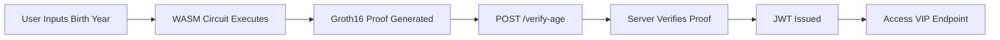

<!-- ===================================================== -->
<!-- CYBER-THEMED ZERO-KNOWLEDGE AGE VERIFICATION README  -->
<!-- ===================================================== -->

<h1 align="center">
  🔐 Zero-Knowledge Age Verification System
</h1>

<p align="center">
  
</p>

<p align="center">
  
  
  
  
</p>

---

## 🧠 Overview

A full-stack cryptographic application that proves:

> ✅ "I am 18 or older"  
> ❌ Without revealing birth year  
> ❌ Without storing PII  
> ❌ Without trusting the server  

The proof is generated **locally in the browser** using zk-SNARKs and verified mathematically by the backend.

---

# ⚙️ System Flow



---

# 🔐 Cryptographic Logic

The circuit computes:

```
CurrentYear - BirthYear ≥ 18
```

But the **BirthYear never leaves the client**.

Only a proof is transmitted.

Mathematics replaces trust.

---

# ✨ Core Security Features

### 🛡️ Client-Side Proving
- WebAssembly (WASM) execution  
- No sensitive data transmission  

### 🧮 Mathematical Verification
- Groth16 protocol via SnarkJS  
- Verification Key stored server-side  

### 🎟️ Stateless Authorization
- JWT issued only after valid proof  
- Bearer token required for protected routes  

### 🚫 State Manipulation Protection
- Event listeners detect input tampering  
- JWT auto-destroyed on modification attempt  

---

# 🏗️ Tech Stack

| Layer | Technology |
|-------|------------|
| Circuit | Circom 2.0 |
| Proof System | SnarkJS (Groth16) |
| Backend | Node.js + Express |
| Auth | JSON Web Tokens |
| Frontend | Vanilla JS / HTML / CSS |
| Execution | WebAssembly (WASM) |

---

# 🚀 Quick Deployment

```bash
# Install dependencies
npm install

# Start backend server
node server.js
```

Visit:

```
http://localhost:3000
```

---

# ⚠️ Production Considerations

## 🔮 Oracle Problem
Currently accepts manual birth year input.

Production version should integrate:
- Verifiable Credentials (VC)
- Government-issued digital identity
- DID-based identity proofs

## 🔐 Trusted Setup Risk
Requires proper Multi-Party Computation (MPC) ceremony  
to eliminate toxic waste.

---

# 📜 License

MIT License

---

<p align="center">
  
</p>

<p align="center">
  <b>Developed by Sarthak Suman</b><br>
  Building Privacy-First Cybersecurity Systems ⚡
</p>
